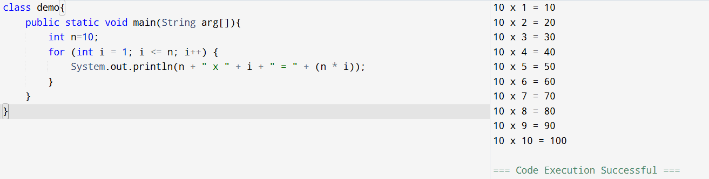
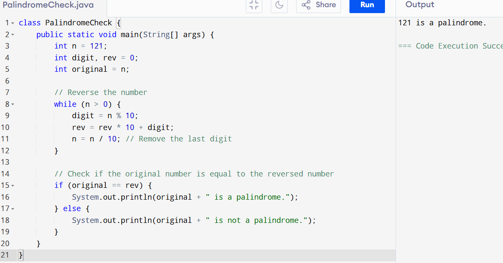

# java program to display n number of even numbers

# java program to display n number of odd numbers.

# java program to find sum of all the number of up to n.

# java program to find sum of even numbers.

# java program to find sum of odd numbers.

# java program to find n factoral.

# java program to display perfect square up to n.

# java program to display mulitpliaction table.

# java program to calcuate sum of each digit.

# java program to display n values in revese.

# java program to display palindrome.

# java program to check arm strong are not.

# java program to find sum of cude.

# java program to find whether it Prime or not.

# java program of reverse String
