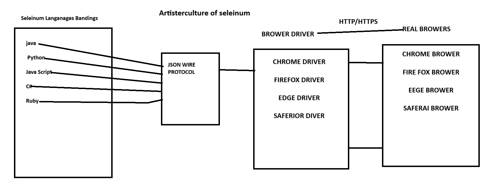

# What is Software Testing . ?

## Software Testing is the process of verfying and vaildating a software application to ensure it works correctly,meets requirements,and is free of defects before release.

# What is Automation Testing?

## Automation testing is the process of testing a software or application using an automation testing tool to find the defects. In this process, executing the test scripts and generating the results are performed automatically by automation tools. It is required when we have a huge amount of regression test cases. Some most popular tools to do automation testing are HP QTP/UFT, Selenium WebDriver, etc.,

# What is a Framework?

## A framework defines a set of rules or best practices that we can follow in a systematic way to achieve the desired results.

    <h1>Architecture of Selenium</h1>

# Selenium Features:

## 1. Selenium is an open-source (no need to purchase) Automation Testing tool.

## 2 .It works on different platforms like Windows, iOS, and Linux.

## 3 .Selenium supports multiple browsers like Chrome, Firefox, and Internet Explorer.

## 4 .It is a tool for web-based applications.

# Different Versions of Selenium:

## Selenium supports versions like Selenium 2, Selenium 3, and Selenium 4. Currently, we are using Selenium 4. There is a difference between Selenium 3 and Selenium 4.

## 1 .Selenium 3 architecture consists of Selenium Client, WebDriver language bindings, and browser drivers, whereas Selenium 4 has a direct client-server connection with browser driver connections.

## 2 .Selenium 3 supports the JSON Wire Protocol, whereas in Selenium 4, it has been removed.

